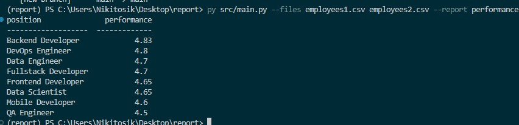

## Подготовка к запуску 
***Создаем виртуальное окружение*** 
<br>
<br>
1. Создаем окружение
```
uv: uv venv
pip: python -m venv venv
```

***Установка зависимостей*** 
<br>
<br>
1. Устанавливаем зависимости
```
uv:   uv pip install pyproject.toml 
pip:  pip install pyproject.toml
```

## Запуск проекта
```
py src/main.py --files employees1.csv employees2.csv --report performance
```

